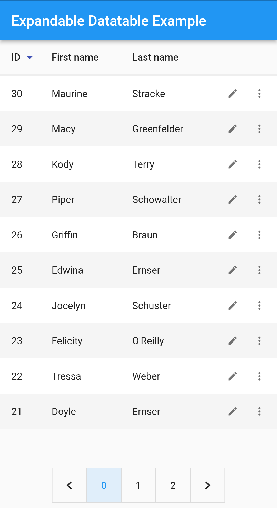
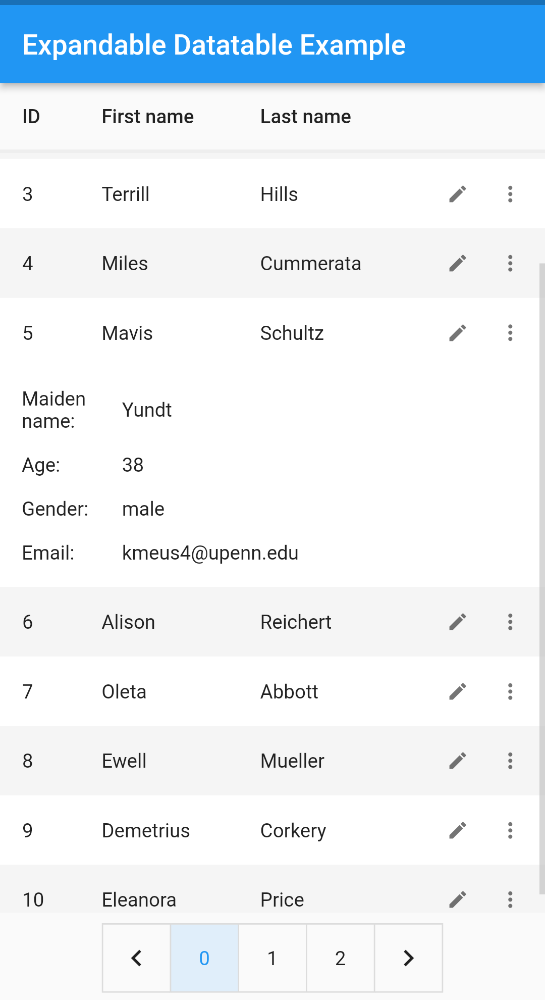
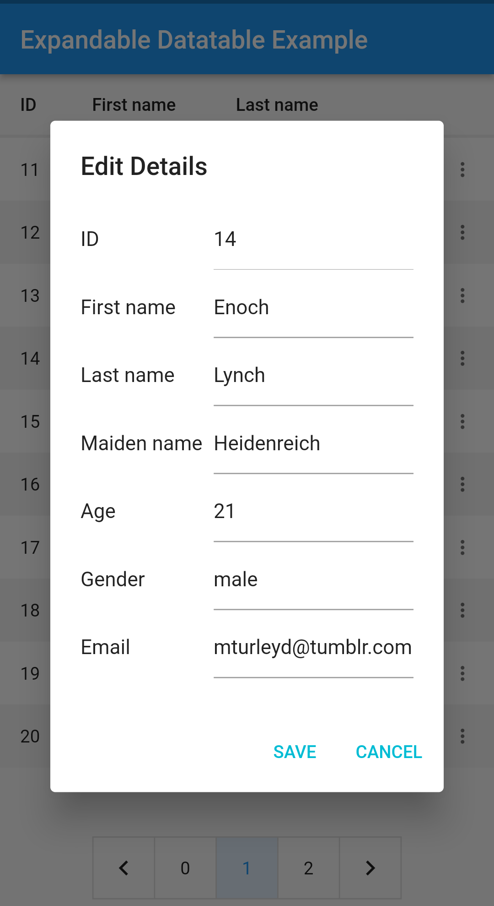
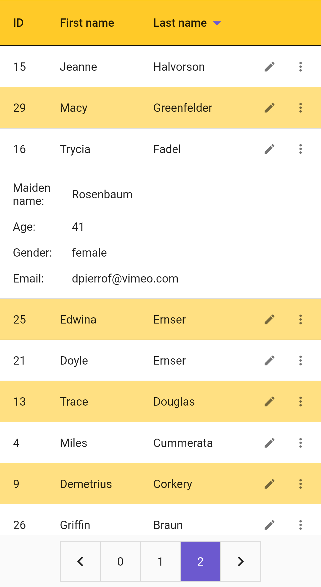

# ExpandableDataTable

ExpandableDataTable is a Flutter library for dealing with displaying and editing data in tabular view. 

## Features

* Row sorting
* Flexible column sizes
* Expandable rows
* Row pagination
* Editable rows 
* Customizable edit dialogs
* Customizable pagination widget
* Customizable expansion content
* Styling rows and header columns


## Usage

1) To use this package, add expandable_datatable as a dependency in your pubspec.yaml file.

2) Import the package
```dart
import ‘package:expandable_datatable/expandable_datatable.dart’;
```

3) Create data to use in the data table

Create the list of the headers to be used in data table with types. Header list should be in a prioritized order, all columns have a flex value that all cells inside that column will be used.

```dart
  List<ExpandableColumn<dynamic>> headers = [
    ExpandableColumn<int>(columnTitle: "ID", columnFlex: 1),
    ExpandableColumn<String>(columnTitle: "First name", columnFlex: 2),
    ExpandableColumn<String>(columnTitle: "Last name", columnFlex: 2),
    ExpandableColumn<String>(columnTitle: "Maiden name", columnFlex: 2),
    ExpandableColumn<int>(columnTitle: "Age", columnFlex: 1),
    ExpandableColumn<String>(columnTitle: "Gender", columnFlex: 2),
    ExpandableColumn<String>(columnTitle: "Email", columnFlex: 4),
  ];
```

Create the list of the rows to be used in data table. All row list elements must contain all columns for lists. 


```dart
  List<ExpandableRow> rows = userList.map<ExpandableRow>((e) {
    return ExpandableRow(cells: [
      ExpandableCell<int>(columnTitle: "ID", value: e.id),
      ExpandableCell<String>(columnTitle: "First name", value: e.firstName),
      ExpandableCell<String>(columnTitle: "Last name", value: e.lastName),
      ExpandableCell<String>(columnTitle: "Maiden name", value: e.maidenName),
      ExpandableCell<int>(columnTitle: "Age", value: e.age),
      ExpandableCell<String>(columnTitle: "Gender", value: e.gender),
      ExpandableCell<String>(columnTitle: "Email", value: e.email),
    ]);
  }).toList();
```

4) Code

```dart
  void createDataSource() {...}

  @override
  Widget build(BuildContext context) {
    return Scaffold(
      appBar: AppBar(
        title: const Text("Expandable Datatable Example"),
      ),
      body: ExpandableTheme(
        data: ExpandableThemeData(
          context,
          rowBorder: const BorderSide(color: Colors.amber),
          expandedBorderColor: Colors.transparent,
          paginationSize: 48,
        ),
        child: ExpandableDataTable(
          rows: rows,
          headers: headers,
          visibleColumnCount: 4,
        ),
      ),
    );
  }
```

## Screenshots

#### Sorting the rows




#### Expansion feature




#### Edit rows dialog (Customizable)




#### Styling



## License

[MIT](https://choosealicense.com/licenses/mit/)

