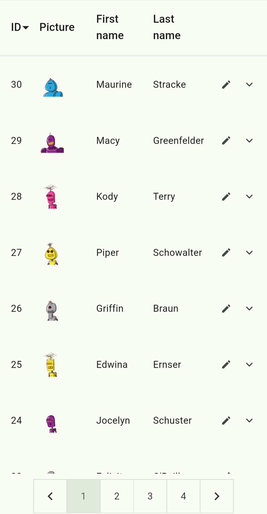
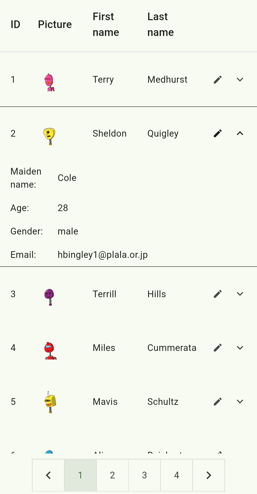
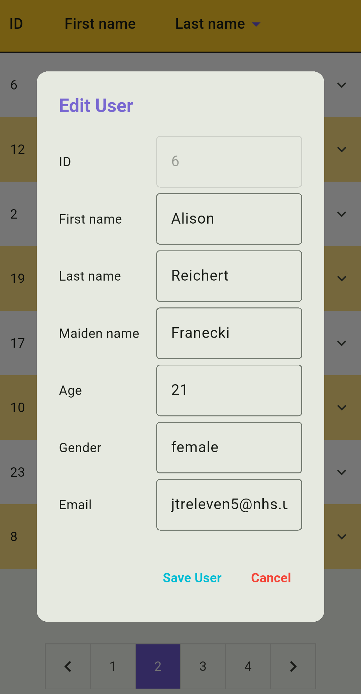
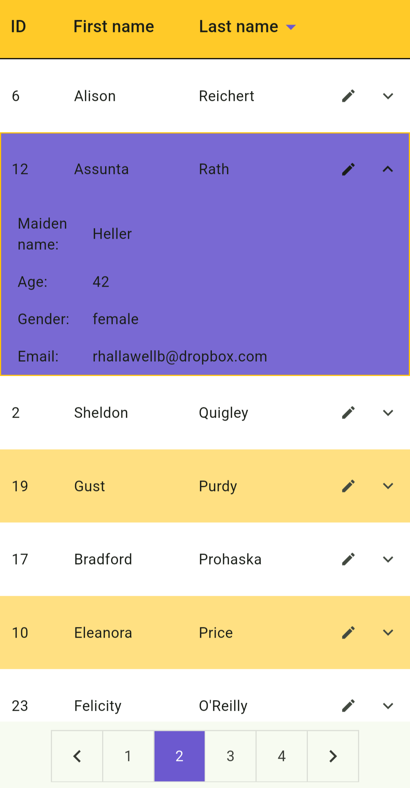

# expandable_datatable

[](https://pub.dev/packages/expandable_datatable)
[](LICENSE)
[](https://flutter.dev)

A Flutter package for displaying and editing tabular data with expandable rows. Overflow columns collapse into a tappable expansion panel, keeping the table clean on any screen size.

---

## Table of Contents

1. [What it does](#what-it-does)
2. [Why it's useful — Features](#why-its-useful--features)
3. [Core API (Start Here)](#core-api-start-here)
4. [Getting started](#getting-started)
5. [Quick example](#quick-example)
6. [Theming with `ExpandableTheme`](#theming-with-expandabletheme)
7. [Row expansion](#row-expansion)
8. [Editing](#editing)
9. [API reference](#api-reference)
10. [Help & support](#help--support)
11. [Contributing](#contributing)
12. [License](#license)

---

## What it does

`expandable_datatable` renders a data table where you control how many columns are **visible**. Columns that exceed `visibleColumnCount` are hidden from the row and instead displayed inside a collapsible expansion panel. This lets you show a clean, narrow table on phones while surfacing all data on demand — without writing custom layout code.

## Why it's useful — Features

- **Expandable rows** — hidden columns fold into a tappable expansion panel per row
- **Responsive column count** — drive `visibleColumnCount` from `LayoutBuilder` to adapt automatically to screen width
- **Column sorting** — tap any header to toggle ascending / descending sort
- **Pagination** — built-in page controls, fully replaceable with a custom widget
- **Editable rows** — built-in edit dialog pre-filled from cell values; or supply your own via `renderEditDialog`
- **Per-column edit guard** — mark individual `ExpandableColumn`s as `isEditable: false` to make them read-only inside the dialog
- **Custom expansion content** — replace the default expansion panel body via `renderExpansionContent`
- **Multiple or single row expansion** — control via `multipleExpansion`
- **Comprehensive theming** — colors, text styles, borders, shapes, icons, animation and more via `ExpandableTheme` / `ExpandableThemeData`

## Screenshots

| Sorting                             | Expansion                               |
| ----------------------------------- | --------------------------------------- |
|  |  |

| Editing                             | Styling                             |
| ----------------------------------- | ----------------------------------- |
|  |  |

---

## Core API (Start Here)

> **TL;DR** — place an `ExpandableDataTable(...)` widget in your tree, wrap it in `ExpandableTheme(data: ExpandableThemeData(...), child: ...)` to style it.

### What is `ExpandableDataTable`?

`ExpandableDataTable` is the **main widget** of this library. It renders the full table UI including the header row, data rows, expansion panels, sort indicators, pagination, and (optionally) the edit dialog. Everything else in the library — `ExpandableColumn`, `ExpandableRow`, `ExpandableCell`, `ExpandableTheme` — exists to configure and feed data into this widget.

### When should I use it?

Use `ExpandableDataTable` whenever you need a data table that:

- has more columns than fit on the current screen, and
- you want the extra columns to be accessible without horizontal scrolling.

### Key properties of `ExpandableDataTable`

| Property                          | Type                                                                          | Default          | What it controls                                                                                                                                 |
| --------------------------------- | ----------------------------------------------------------------------------- | ---------------- | ------------------------------------------------------------------------------------------------------------------------------------------------ |
| `headers` _(required)_            | `List<ExpandableColumn>`                                                      | —                | Column definitions (title, flex, editability). Must align with `rows[i].cells`.                                                                  |
| `rows` _(required)_               | `List<ExpandableRow>`                                                         | —                | The data. Each `ExpandableRow` holds one `ExpandableCell` per header.                                                                            |
| `visibleColumnCount` _(required)_ | `int`                                                                         | —                | How many columns are shown in the row; the rest go into the expansion panel. Must be `> 0`.                                                      |
| `pageSize`                        | `int`                                                                         | `10`             | Rows per page. Must be `> 0`.                                                                                                                    |
| `multipleExpansion`               | `bool`                                                                        | `true`           | `true` = multiple rows can be open at once; `false` = opening one closes others.                                                                 |
| `isEditable`                      | `bool`                                                                        | `false`          | Shows an edit icon on each row. Requires `onRowChanged` to be provided.                                                                          |
| `onRowChanged`                    | `void Function(ExpandableRow newRow, int originalIndex)?`                     | `null`           | Called when the user saves an edit. `originalIndex` is the row's position in the `rows` list you provided. Required when `isEditable` is `true`. |
| `onPageChanged`                   | `void Function(int page)?`                                                    | `null`           | Called whenever the current page changes.                                                                                                        |
| `editDialogTitle`                 | `String?`                                                                     | `'Edit Details'` | Title text of the built-in edit dialog.                                                                                                          |
| `editSaveLabel`                   | `String?`                                                                     | `'SAVE'`         | Label of the save button in the built-in edit dialog.                                                                                            |
| `editCancelLabel`                 | `String?`                                                                     | `'CANCEL'`       | Label of the cancel button in the built-in edit dialog.                                                                                          |
| `nullValuePlaceholder`            | `String`                                                                      | `''`             | Text shown when a cell's value is `null`.                                                                                                        |
| `renderEditDialog`                | `Widget Function(ExpandableRow row, void Function(ExpandableRow) onSuccess)?` | `null`           | Replaces the built-in edit dialog with a custom widget. Call `onSuccess(newRow)` to commit.                                                      |
| `renderCustomPagination`          | `Widget Function(int count, int page, void Function(int) onChange)?`          | `null`           | Replaces the built-in pagination widget.                                                                                                         |
| `renderExpansionContent`          | `Widget Function(ExpandableRow row)?`                                         | `null`           | Replaces the default expansion panel content for each row.                                                                                       |

> More properties and full documentation: [pub.dev API reference](https://pub.dev/documentation/expandable_datatable/latest/).

### How do I theme it with `ExpandableTheme`?

`ExpandableTheme` is an `InheritedWidget`. Wrap `ExpandableDataTable` with it and pass an `ExpandableThemeData` instance:

```dart
ExpandableTheme(
  data: ExpandableThemeData(
    headerColor: Colors.amber,
    evenRowColor: Colors.white,
    oddRowColor: Colors.amber[100],
  ),
  child: ExpandableDataTable(
    headers: headers,
    rows: rows,
    visibleColumnCount: 3,
  ),
)
```

If no `ExpandableTheme` is present in the tree, `ExpandableThemeData` defaults are used automatically.

### Key properties of `ExpandableThemeData`

Properties are grouped by the part of the table they affect.

#### Header

| Property              | Type          | Default                                            | What it controls                            |
| --------------------- | ------------- | -------------------------------------------------- | ------------------------------------------- |
| `headerColor`         | `Color?`      | `ColorScheme.surface`                              | Header row background color.                |
| `headerTextStyle`     | `TextStyle?`  | `TextTheme.titleMedium`                            | Text style for header cells.                |
| `headerTextMaxLines`  | `int?`        | `2`                                                | Max lines before clipping in a header cell. |
| `headerSortIconColor` | `Color?`      | `null`                                             | Color of the sort arrow icon.               |
| `headerHeight`        | `double?`     | `null`                                             | Fixed height for the header row.            |
| `headerBorder`        | `BorderSide?` | `BorderSide(width: 2.5, color: Color(0xffeeeeee))` | Border drawn below the header row.          |

#### Rows

| Property                  | Type            | Default                 | What it controls                                                                     |
| ------------------------- | --------------- | ----------------------- | ------------------------------------------------------------------------------------ |
| `contentPadding`          | `EdgeInsets?`   | `EdgeInsets.all(16)`    | Padding inside every header and data row cell.                                       |
| `rowColor`                | `Color?`        | `ColorScheme.surface`   | Background for all rows. Ignored when both `evenRowColor` and `oddRowColor` are set. |
| `evenRowColor`            | `Color?`        | `null`                  | Background for even-indexed rows. Both `evenRowColor` and `oddRowColor` must be set. |
| `oddRowColor`             | `Color?`        | `null`                  | Background for odd-indexed rows. Both `evenRowColor` and `oddRowColor` must be set.  |
| `expandedBackgroundColor` | `Color?`        | `null`                  | Background applied to a row when its expansion panel is open.                        |
| `rowTextStyle`            | `TextStyle?`    | `TextTheme.bodyMedium`  | Text style for data row cells.                                                       |
| `rowTextMaxLines`         | `int?`          | `3`                     | Max lines before clipping/ellipsis in a data cell.                                   |
| `rowTextOverflow`         | `TextOverflow?` | `TextOverflow.ellipsis` | Overflow behavior for data cell text.                                                |
| `rowHeight`               | `double?`       | `null`                  | Fixed height for data rows.                                                          |
| `shape`                   | `ShapeBorder?`  | Transparent border      | Border shape of a **collapsed** row.                                                 |
| `expandedShape`           | `ShapeBorder?`  | Divider-color border    | Border shape of an **expanded** row.                                                 |

#### Expansion panel & icons

| Property                   | Type                  | Default                             | What it controls                                                                           |
| -------------------------- | --------------------- | ----------------------------------- | ------------------------------------------------------------------------------------------ |
| `expansionIcon`            | `Icon?`               | `Icon(Icons.expand_more, size: 20)` | Icon on each row that toggles the expansion panel.                                         |
| `editIcon`                 | `Icon?`               | `Icon(Icons.edit, size: 16)`        | Edit icon shown on each row when `isEditable` is `true`.                                   |
| `iconColor`                | `Color?`              | `ColorScheme.onSurfaceVariant`      | Icon color when the row is **collapsed**.                                                  |
| `expandedIconColor`        | `Color?`              | `ColorScheme.onSurface`             | Icon color when the row is **expanded**.                                                   |
| `expandedTextStyle`        | `TextStyle?`          | `TextTheme.bodyMedium`              | Text style used inside the expansion panel.                                                |
| `expansionAnimationStyle`  | `AnimationStyle?`     | 200 ms / `Curves.easeIn`            | Duration and curve of the open/close animation. Pass `AnimationStyle.noAnimation` to skip. |
| `expansionChildrenPadding` | `EdgeInsetsGeometry?` | `EdgeInsets.zero`                   | Padding that wraps the expansion panel child widget.                                       |
| `expansionCellPadding`     | `EdgeInsetsGeometry?` | Screen-relative default             | Padding around each key–value cell inside the expansion panel.                             |

#### Edit dialog

| Property                    | Type               | Default                       | What it controls                                                                        |
| --------------------------- | ------------------ | ----------------------------- | --------------------------------------------------------------------------------------- |
| `editDialogTitleStyle`      | `TextStyle?`       | `AlertDialog` default         | Text style for the dialog title.                                                        |
| `editDialogBackgroundColor` | `Color?`           | `DialogTheme.backgroundColor` | Edit dialog background color.                                                           |
| `editDialogShape`           | `ShapeBorder?`     | `DialogTheme.shape`           | Shape (e.g. rounded corners) of the edit dialog.                                        |
| `editSaveButtonTextStyle`   | `TextStyle?`       | Cyan bold                     | Text style for the SAVE button.                                                         |
| `editCancelButtonTextStyle` | `TextStyle?`       | Cyan                          | Text style for the CANCEL button.                                                       |
| `editInputDecoration`       | `InputDecoration?` | `null`                        | Base `InputDecoration` for all text fields. Per-column `hintText` overrides `hintText`. |

#### Pagination

| Property                        | Type            | Default | What it controls                      |
| ------------------------------- | --------------- | ------- | ------------------------------------- |
| `paginationSize`                | `double?`       | `48.0`  | Size of the page number buttons.      |
| `paginationSelectedFillColor`   | `Color?`        | `null`  | Fill color of the active page button. |
| `paginationSelectedTextColor`   | `Color?`        | `null`  | Text color of the active page number. |
| `paginationUnselectedTextColor` | `Color?`        | `null`  | Text color of inactive page numbers.  |
| `paginationBorderColor`         | `Color?`        | `null`  | Border color applied to page buttons. |
| `paginationBorderRadius`        | `BorderRadius?` | `null`  | Corner radius of page buttons.        |
| `paginationBorderWidth`         | `double?`       | `null`  | Border width of page buttons.         |

> Full constructor and all properties: [pub.dev API reference](https://pub.dev/documentation/expandable_datatable/latest/).

---

## Getting started

**Install:**

```bash
flutter pub add expandable_datatable
```

Or add manually to `pubspec.yaml`:

```yaml
dependencies:
  expandable_datatable: ^0.2.2
```

**Minimum SDK constraints:**

- Dart `>=2.17.6 <4.0.0`
- Flutter `>=1.17.0`

**Import:**

```dart
import 'package:expandable_datatable/expandable_datatable.dart';
```

---

## Quick example

Below is a minimal working snippet. See [example/lib/main.dart](example/lib/main.dart) for a complete runnable app.

```dart
import 'package:expandable_datatable/expandable_datatable.dart';
import 'package:flutter/material.dart';

class UsersTable extends StatelessWidget {
  const UsersTable({super.key});

  @override
  Widget build(BuildContext context) {
    // 1. Define columns (headers).
    final headers = [
      ExpandableColumn<int>(columnTitle: 'ID', columnFlex: 1),
      ExpandableColumn<String>(columnTitle: 'First name', columnFlex: 2),
      ExpandableColumn<String>(columnTitle: 'Last name', columnFlex: 2),
      ExpandableColumn<int>(columnTitle: 'Age', columnFlex: 1),
      ExpandableColumn<String>(columnTitle: 'Email', columnFlex: 4),
    ];

    // 2. Map your data to ExpandableRow / ExpandableCell.
    //    columnTitle in each cell MUST match the corresponding header.
    final rows = [
      ExpandableRow(cells: [
        ExpandableCell<int>(columnTitle: 'ID', value: 1),
        ExpandableCell<String>(columnTitle: 'First name', value: 'Jane'),
        ExpandableCell<String>(columnTitle: 'Last name', value: 'Doe'),
        ExpandableCell<int>(columnTitle: 'Age', value: 30),
        ExpandableCell<String>(
            columnTitle: 'Email', value: 'jane@example.com'),
      ]),
    ];

    // 3. Wrap with ExpandableTheme (optional but recommended),
    //    then place ExpandableDataTable.
    return Scaffold(
      body: ExpandableTheme(
        data: const ExpandableThemeData(
          contentPadding: EdgeInsets.all(10),
          headerColor: Colors.amber,
        ),
        child: LayoutBuilder(
          builder: (context, constraints) {
            // 4. Adjust visibleColumnCount to screen width.
            final visibleCount = constraints.maxWidth < 600 ? 3 : 5;

            return ExpandableDataTable(
              headers: headers,
              rows: rows,
              visibleColumnCount: visibleCount, // required
            );
          },
        ),
      ),
    );
  }
}
```

> **Tip:** `ExpandableColumn` is generic — pass the Dart type of the data (`int`, `String`, etc.) so the library can handle sorting and editing correctly.

---

## Theming with `ExpandableTheme`

Wrap `ExpandableDataTable` with `ExpandableTheme` anywhere in the tree above the table. The table reads it automatically via `ExpandableTheme.of(context)`. If no `ExpandableTheme` is present, sensible defaults from `ExpandableThemeData()` are used.

```dart
ExpandableTheme(
  data: ExpandableThemeData(
    // ── Header ──────────────────────────────────────────────────────────
    headerColor: Colors.amber[400],
    headerSortIconColor: Colors.deepPurple,
    headerBorder: const BorderSide(color: Colors.black, width: 1),
    headerTextMaxLines: 2,

    // ── Rows ────────────────────────────────────────────────────────────
    evenRowColor: Colors.white,
    oddRowColor: Colors.amber[200],
    expandedBackgroundColor: Colors.deepPurple.withOpacity(0.15),
    rowTextMaxLines: 2,
    rowTextOverflow: TextOverflow.ellipsis,
    shape: const RoundedRectangleBorder(
      side: BorderSide(color: Colors.transparent),
    ),
    expandedShape: const RoundedRectangleBorder(
      side: BorderSide(color: Colors.amber),
    ),

    // ── Animation ───────────────────────────────────────────────────────
    expansionAnimationStyle: AnimationStyle(
      curve: Curves.easeInOut,
      duration: const Duration(milliseconds: 300),
    ),

    // ── Pagination ──────────────────────────────────────────────────────
    paginationSize: 48,
    paginationSelectedFillColor: Colors.deepPurple,
    paginationSelectedTextColor: Colors.white,

    // ── Edit dialog ─────────────────────────────────────────────────────
    editDialogShape: RoundedRectangleBorder(
      borderRadius: BorderRadius.circular(12),
    ),
    editInputDecoration: const InputDecoration(
      border: OutlineInputBorder(),
    ),
    editCancelButtonTextStyle: const TextStyle(
      color: Colors.red,
      fontWeight: FontWeight.bold,
    ),
  ),
  child: ExpandableDataTable(
    headers: headers,
    rows: rows,
    visibleColumnCount: 3,
    pageSize: 8,
  ),
)
```

---

## Row expansion

By default the expansion panel lists every hidden column and its value. Replace it with `renderExpansionContent` to build any custom widget:

```dart
ExpandableDataTable(
  headers: headers,
  rows: rows,
  visibleColumnCount: 3,
  renderExpansionContent: (row) {
    // row.cells contains ALL cells, including visible ones.
    return Padding(
      padding: const EdgeInsets.all(12),
      child: Column(
        crossAxisAlignment: CrossAxisAlignment.start,
        children: [
          Text('Age: ${row.cells[3].value}'),
          Text('Email: ${row.cells[4].value}'),
        ],
      ),
    );
  },
)
```

Allow only one row open at a time:

```dart
ExpandableDataTable(
  ...
  multipleExpansion: false,
)
```

---

## Editing

Set `isEditable: true` to show an edit icon on every row. The built-in dialog pre-fills each field from the current cell values. You **must** provide `onRowChanged` when editing is enabled:

```dart
ExpandableDataTable(
  headers: headers,
  rows: rows,
  visibleColumnCount: 3,
  isEditable: true,
  editDialogTitle: 'Edit User',
  editSaveLabel: 'Save',
  editCancelLabel: 'Cancel',
  onRowChanged: (newRow, originalIndex) {
    // Update your external state here.
    setState(() => myRows[originalIndex] = newRow);
  },
)
```

Mark a column **read-only** inside the dialog:

```dart
ExpandableColumn<int>(
  columnTitle: 'ID',
  columnFlex: 1,
  isEditable: false, // shown in dialog but cannot be edited
)
```

Add a per-column **hint text** for the input field:

```dart
ExpandableColumn<String>(
  columnTitle: 'First name',
  columnFlex: 2,
  hintText: 'Enter first name',
)
```

Provide a **fully custom edit dialog**:

```dart
ExpandableDataTable(
  ...
  renderEditDialog: (row, onSuccess) {
    return AlertDialog(
      title: const Text('Custom edit'),
      content: TextButton(
        child: const Text('Apply change'),
        onPressed: () {
          row.cells[1].value = 'Updated name';
          onSuccess(row); // commits changes and triggers onRowChanged
        },
      ),
    );
  },
)
```

Replace the **pagination widget**:

```dart
ExpandableDataTable(
  ...
  renderCustomPagination: (count, page, onChange) {
    return Row(
      mainAxisAlignment: MainAxisAlignment.spaceAround,
      children: [
        TextButton(
          onPressed: page > 0 ? () => onChange(page - 1) : null,
          child: const Text('Previous'),
        ),
        Text('Page ${page + 1} of $count'),
        TextButton(
          onPressed: page < count - 1 ? () => onChange(page + 1) : null,
          child: const Text('Next'),
        ),
      ],
    );
  },
)
```

---

## API reference

Full API documentation — all classes, properties and their signatures — is available on pub.dev:

[https://pub.dev/documentation/expandable_datatable/latest/](https://pub.dev/documentation/expandable_datatable/latest/)

---

## Help & support

Found a bug or want a new feature? Open an issue on GitHub:

[https://github.com/ismailyegnr/expandable_datatable/issues](https://github.com/ismailyegnr/expandable_datatable/issues)

---

## Contributing

Contributions are welcome! Please open a pull request on [GitHub](https://github.com/ismailyegnr/expandable_datatable). A `CONTRIBUTING.md` with branch naming and testing guidelines does not yet exist — feel free to propose one.

---

## License

[MIT](LICENSE) © ismailyegnr
